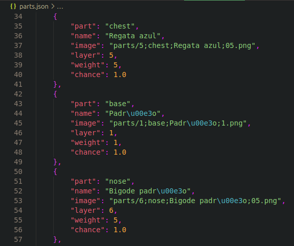

(this file was translated by ChatGPT due to personal lazy problems. any grammar error is not entirely my fault)

The Minter is an algorithm designed to generate images based on a set of images that follows a naming convention described below.

To use the algorithm, you must store all images in the `parts` folder.

## Naming Rules for Parts

Format: `<layer>;<part>;<name>;<weight>.png`

- Layer: A positive integer from 0 to 100.
- Part: The name of the space the item will occupy. Only one item will be randomly selected for each space. Be mindful of case sensitivity, as it can differentiate parts. For example, "Top" and "top" will be considered different parts.
- Name: The display name for end users. This name will appear publicly.
- Weight: A value from 0 to infinity (extraordinary values, probably above 2 million, may cause the minter to malfunction). The higher the weight, the more common the item; the lower the weight, the rarer it is compared to other items.

# update.py

In the `updater.py` file, all images in the `parts` folder will be mapped and recorded in a final JSON file: `parts.json`. In this file, each item (part) will have the following properties:

- `part`: Refers to the group to which the item belongs, where only one item will be randomly selected. Examples: *top*, *legs*, *chest*, *foot*, etc.
- `name`: The public name of the item.
- `image`: Points to the PNG image of the specific part.
- `layer`: Determines which image will be drawn first when generating the mint. This ensures that some images appear in front while others remain behind.
- `weight`: The weight initially assigned to that part.
- `chance`: The final calculation of the probability that the item will be selected after comparing the weights of all items in the same group.

Below is an example of some objects inserted into `parts.json`:

---

The Updater is responsible for calculating the probability of each item being selected during the minting process, based on the total sum of weights of each part in relation to its individual weight.

Imagine we have two items:

1 - An item with `part == "ball"` and `name == "blue ball"`
2 - An item with `part == "ball"` and `name == "red ball"`

The first thing to understand is that the updater will iterate through all registered items in `parts.json`. For each different `part` it encounters, it will store it in a list along with the total sum of weights for all items with the same `part` field.

This list helps identify all different parts and their total weights. At this stage, incorrectly named parts (e.g., *top* vs. *Top*, *hat* vs. *rat*, *foot* vs. *feet*) would be treated as separate entities.

To fully understand how the weight system works, imagine that for each unique part, the updater creates a box. In our example, there is only one box labeled "ball." Each item belonging to this part will be placed into the box according to its weight.

If both the blue and red balls have a weight of 1, the "ball" box will contain one of each color. If someone randomly picks a ball, the chance of getting either is equal (50%).

Now, if the blue ball has a weight of 3, the probability of picking a blue ball becomes 75%, because while there is only 1 red ball, there are 3 blue balls.

The trick here is that the quantity (weight) of items does not directly determine their probability, but rather their proportion relative to the total weight in the box. This means that adding 3 red balls would not increase their probability to 75% but instead equalize their chances with the blue balls (50% each, since both have the same total weight).

To prevent things from getting out of control, it is **recommended** to define a maximum weight for *common* items (the lowest rarity), for example, a weight of 1,000. The rarer an item is, the lower its weight should be below 1,000.

`Chance = Weight / Sum` where:

- `Chance`: The percentage probability of the item being selected during minting.
- `Weight`: The assigned weight of that item.
- `Sum`: The total sum of weights for all items of the same type.

---

# minter.py

The minter generates the final artwork and a JSON file for each artwork containing its metadata. The metadata simply describes each part of the minted image.

Its function is to take all data from `parts.json`, which contains information about each item mapped by the updater, and transform them into images in the `mints` folder. Along with generating images, it also creates a JSON file in the same folder with the same name as the image. This file maps the parts of the minted artwork.

Similar to the updater, the minter also constructs a list of all different parts found in `parts.json`. It then iterates through this list and, for each part, calls the `draw(type)` function, passing the current part as an argument.

## Draw(type)

The function searches for all items where `part == type`. If `type` is `top`, for example, it will store all items belonging to `top` in a list. This list is then SORTED according to the `chance` property of each found part.

As we know, the `chance` field has a value between 0 and 1, where 0 means no chance, 0.5 means 50% probability, and 1 means 100% probability.

After sorting the parts by chance, a value is randomly selected between 0 and 1 and stored in `dice`. This is the lucky number used to determine which part the mint selects.

The selection works as follows: the algorithm iterates through the sorted list of items and checks if the `dice` value is lower than the chance of the current item. If so, it means the random number "landed within" the probability range of that item, and that item is returned by the function.

After completing this process, the minting is finalized, and all minted images will be stored in the `mints` folder.
